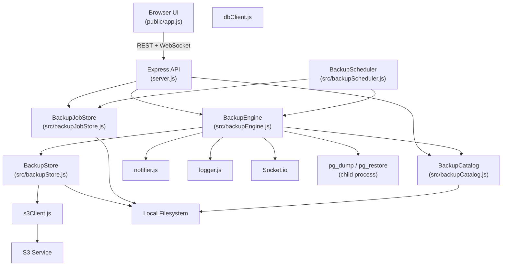
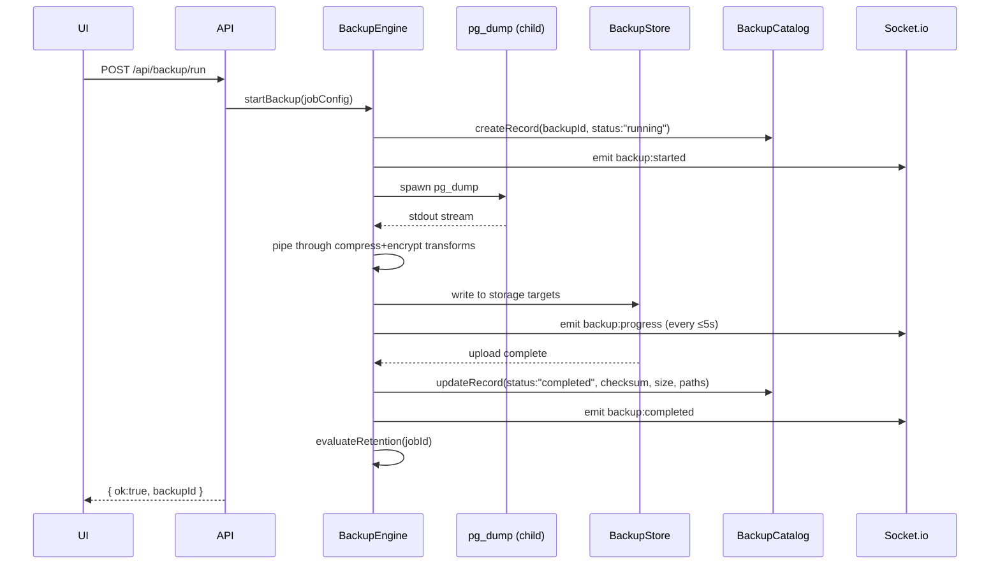

    # Design Document: Database Backup

## Overview

This document describes the technical design for the database backup subsystem added to S3 Backup Studio. The feature introduces a complete PostgreSQL backup lifecycle: on-demand and scheduled backup creation, multiple output formats, compression, AES-256-GCM encryption, storage to S3 and/or local filesystem, a persistent catalog, integrity verification, retention policy enforcement, restore operations, real-time WebSocket progress, and a dedicated UI tab.

The design follows the same architectural patterns already established in the codebase: ES module server-side code, Socket.io for real-time events, JSON files for persistence, the existing `s3Client.js` for S3 operations, `notifier.js` for notifications, and `logger.js` for structured logging.

### Key Design Decisions

- **pg_dump / pg_restore via child_process**: Rather than re-implementing PostgreSQL's dump logic, the engine shells out to `pg_dump` and `pg_restore`/`psql`. This is the industry-standard approach and gives us all four formats (custom, plain, directory, tar) for free.
- **Streaming pipeline**: Backup data flows through a Node.js stream pipeline — dump stdout → optional compression transform → optional encryption transform → storage write stream — avoiding large in-memory buffers.
- **Atomic catalog writes**: The catalog file uses the same write-to-temp-then-rename pattern as `jobStore.js` to prevent corruption on crash.
- **Scheduler as a thin wrapper**: The scheduler holds a `Map<jobId, NodeJS.Timeout>` of scheduled timers and delegates all execution to `BackupEngine`. It re-reads the job config on each trigger so schedule changes take effect without restart.
- **Encryption header embedded in artifact**: The PBKDF2 salt and AES-GCM IV are prepended to the ciphertext so the artifact is self-contained — no external metadata needed for decryption.

---

## Architecture



### Data Flow: Backup Operation



---

## Components and Interfaces

### BackupEngine (`src/backupEngine.js`)

The central orchestrator. Manages the lifecycle of backup and restore operations.

```js
// Public API
export function initBackupEngine(io)
export async function startBackup(jobConfig)        // returns { ok, backupId }
export async function startRestore(backupId, target, restoreOptions, passphrase)
export async function verifyBackup(backupId)
export async function applyRetention(jobId)
export async function rotateKey(jobId, currentPassphrase, newPassphrase)
export function getActiveBackups()                  // returns Map snapshot
export function getActiveRestores()                 // returns Map snapshot
```

Internal state:
- `_activeBackups: Map<backupId, AbortController>` — tracks in-progress backups
- `_activeRestores: Map<backupId, AbortController>` — tracks in-progress restores
- `_io` — Socket.io server reference

### BackupCatalog (`src/backupCatalog.js`)

Manages the persistent catalog of backup records in `data/backup-catalog.json`.

```js
export function loadCatalog()                       // returns BackupCatalogRecord[]
export function getCatalogRecord(backupId)          // returns BackupCatalogRecord | null
export function createCatalogRecord(record)         // returns BackupCatalogRecord
export function updateCatalogRecord(backupId, updates) // returns BackupCatalogRecord | null
export function listCatalog()                       // returns records sorted by startedAt desc, secrets redacted
export function pruneCatalog()                      // enforces 1000-record limit
```

### BackupJobStore (`src/backupJobStore.js`)

Manages persisted `BackupJob` configurations in `data/backup-jobs.json`. Mirrors the pattern of `src/jobStore.js`.

```js
export function listBackupJobs()                    // secrets redacted
export function getBackupJob(id)                    // full record including secrets
export function createBackupJob(data)               // returns created job with generated id
export function updateBackupJob(id, data)           // returns updated job | null
export function deleteBackupJob(id)                 // returns boolean
```

### BackupStore (`src/backupStore.js`)

Abstracts over S3 and local filesystem storage targets.

```js
export async function writeToTargets(targets, sourceStream, artifactName, encryption)
  // returns [{ type, path, sizeBytes, ok, error }]
export async function readFromTarget(storagePath, encryption)
  // returns a readable stream (decrypted if encrypted)
export async function deleteFromTarget(storagePath)
  // returns { ok, error }
export function buildArtifactPath(prefix, jobName, date, backupId, ext)
  // returns string matching {prefix}/{jobName}/{YYYY-MM-DD}/{backupId}.{ext}
```

### BackupScheduler (`src/backupScheduler.js`)

Manages cron and interval-based scheduling.

```js
export function initScheduler(io)
export function scheduleJob(job)                    // adds or replaces timer for job
export function unscheduleJob(jobId)                // removes timer
export function rescheduleJob(job)                  // unschedule + schedule
export function getScheduledJobs()                  // returns Map snapshot
```

### API Routes (additions to `server.js`)

```
POST   /api/backup/run                    — start an on-demand backup
POST   /api/backup/restore                — start a restore operation
POST   /api/backup/verify/:backupId       — trigger integrity check
GET    /api/backup/verify/:backupId       — get current verification status
POST   /api/backup/test-notification      — send test notification

GET    /api/backup/jobs                   — list all backup jobs (secrets redacted)
POST   /api/backup/jobs                   — create a backup job
GET    /api/backup/jobs/:id               — get a single backup job (with secrets)
PUT    /api/backup/jobs/:id               — update a backup job
DELETE /api/backup/jobs/:id               — delete a backup job
POST   /api/backup/jobs/:id/apply-retention — trigger retention evaluation
POST   /api/backup/jobs/:id/rotate-key    — re-encrypt artifacts with new passphrase

GET    /api/backup/catalog                — list catalog records (secrets redacted)
GET    /api/backup/catalog/:backupId      — get single catalog record
```

---

## Data Models

### BackupJob

```js
{
  id: string,                    // UUID, generated on create
  name: string,                  // human-readable label
  source: {
    host: string,
    port: number,                // default 5432
    database: string,
    user: string,
    password: string,            // stored in backup-jobs.json, redacted in list API
    sslMode: string,             // optional: "disable" | "require" | "verify-full"
  },
  format: "custom" | "plain" | "directory" | "tar",
  compression: {
    type: "none" | "gzip" | "lz4",
    level: number,               // 1-9 for gzip, ignored for lz4/none; default 6
  },
  includeTables: string[],       // empty = all tables
  excludeTables: string[],
  includeSchemas: string[],      // empty = all schemas
  excludeSchemas: string[],
  storageTargets: [
    {
      type: "s3",
      region: string,
      bucket: string,
      prefix: string,
      accessKeyId: string,
      secretAccessKey: string,   // redacted in list API
      endpoint: string | null,   // for S3-compatible stores
    } | {
      type: "local",
      localPath: string,         // absolute path on server
    }
  ],
  schedule: string | number | null,  // cron string, interval seconds, or null
  retentionPolicy: {
    keepLast: number | null,
    keepDailyFor: number | null,     // days
    keepWeeklyFor: number | null,    // weeks
    keepMonthlyFor: number | null,   // months
  } | null,
  encryption: {
    enabled: boolean,
    passphrase: string,          // stored in backup-jobs.json, NEVER in catalog
  } | null,
  notifications: {               // same schema as existing sync notifications
    webhook: {
      url: string,
      onComplete: boolean,
      onFailure: boolean,
    },
    email: {
      host: string, port: string, user: string, pass: string,
      from: string, to: string,
      onComplete: boolean, onFailure: boolean,
    },
  } | null,
  createdAt: string,             // ISO 8601
  updatedAt: string,
}
```

### BackupCatalogRecord

```js
{
  backupId: string,              // UUID, generated at backup start
  jobId: string,
  jobName: string,
  triggerSource: "manual" | "scheduled",
  source: {
    host: string,
    port: number,
    database: string,
    // NOTE: no password stored here
  },
  format: "custom" | "plain" | "directory" | "tar",
  compression: { type: string, level: number },
  encrypted: boolean,
  storagePaths: [
    { type: "s3" | "local", path: string, sizeBytes: number, status: "ok" | "failed" }
  ],
  sizeBytes: number,
  sha256Checksum: string,
  durationMs: number,
  status: "running" | "completed" | "failed" | "verified" | "corrupted" | "deleted" | "delete_failed",
  startedAt: string,             // ISO 8601
  completedAt: string | null,
  errorMessage: string | null,
  includeTables: string[],
  excludeTables: string[],
  includeSchemas: string[],
  excludeSchemas: string[],
  lastVerifiedAt: string | null,
  lastRestoredAt: string | null,
  lastRestoreTarget: { host: string, database: string } | null,
}
```

### WebSocket Event Schemas

```js
// backup:started
{ backupId, jobId, jobName, format, source: { host, database }, estimatedSizeBytes }

// backup:progress
{ backupId, phase: "connecting"|"dumping"|"compressing"|"encrypting"|"uploading",
  bytesWritten, elapsedMs, estimatedRemainingMs }

// backup:completed
{ backupId, sizeBytes, durationMs, storagePaths }

// backup:failed
{ backupId, errorMessage }

// backup:corrupted
{ backupId, errorMessage }

// restore:started
{ backupId, jobName, source: { host, database }, target: { host, database } }

// restore:progress
{ backupId, phase: "downloading"|"decrypting"|"restoring"|"verifying", elapsedMs }

// restore:completed
{ backupId, durationMs, target: { host, database } }

// restore:failed
{ backupId, errorMessage }
```

---

## Encryption Implementation

### Algorithm

- **Cipher**: AES-256-GCM (authenticated encryption — provides both confidentiality and integrity)
- **Key derivation**: PBKDF2 with SHA-256, 100,000 iterations, 32-byte output key
- **Salt**: 16 random bytes, generated fresh for each backup
- **IV (nonce)**: 12 random bytes, generated fresh for each backup
- **Auth tag**: 16 bytes, appended by Node's `crypto.createCipheriv`

### Artifact Binary Layout

```
Offset  Length  Field
------  ------  -----
0       1       Format version byte (0x01)
1       16      PBKDF2 salt
17      12      AES-GCM IV
29      16      AES-GCM auth tag
45      N       Ciphertext (encrypted backup data)
```

Total header overhead: 45 bytes.

### Encryption Stream Transform

```js
// Pseudocode for the encryption transform used in the pipeline
function createEncryptStream(passphrase) {
  const salt = crypto.randomBytes(16);
  const iv   = crypto.randomBytes(12);
  const key  = crypto.pbkdf2Sync(passphrase, salt, 100_000, 32, 'sha256');
  const cipher = crypto.createCipheriv('aes-256-gcm', key, iv);

  // Header is written as the first chunk
  const header = Buffer.concat([Buffer.from([0x01]), salt, iv]);
  // Auth tag is appended after cipher.final()
  return { cipher, header, getAuthTag: () => cipher.getAuthTag() };
}
```

### Decryption

On restore, the engine reads the first 45 bytes to extract version, salt, and IV, derives the key from the provided passphrase, and creates a `crypto.createDecipheriv('aes-256-gcm', key, iv)` stream. If the auth tag does not match (wrong passphrase or corrupted data), GCM authentication fails and the engine emits `restore:failed` without writing any data to the target database.

### Key Rotation (`POST /api/backup/jobs/:id/rotate-key`)

1. Load all `"completed"` or `"verified"` catalog records for the job.
2. For each artifact: download → decrypt with `currentPassphrase` → re-encrypt with `newPassphrase` → upload back to the same storage path.
3. Update the job's `encryption.passphrase` in `backup-jobs.json`.
4. This operation is performed sequentially to avoid excessive memory/bandwidth usage.

---

## Frontend Changes

### New "Backup" Tab

A fourth tab button is added to the top navigation bar alongside S3, Database, and Cluster:

```html
<button class="tab-btn" id="mode-backup">Backup</button>
```

### Sub-sections

The Backup panel contains three sub-sections, toggled by secondary tab buttons:

1. **Jobs** — Backup_Job list and editor form
2. **Catalog** — Backup_Catalog table with actions
3. **Run** — Active backup/restore progress panel

### Jobs Sub-section

A form covering all `BackupJob` fields:
- Source connection (host, port, database, user, password, SSL mode)
- Storage targets (add/remove S3 or local targets)
- Format selector (custom / plain / directory / tar)
- Compression (none / gzip / lz4, level slider for gzip)
- Selective tables/schemas (textarea, one per line)
- Schedule (cron expression or interval seconds)
- Retention policy (keepLast, keepDailyFor, keepWeeklyFor, keepMonthlyFor)
- Encryption toggle + passphrase field
- Notifications (reuses existing webhook/email fields)

A job list panel shows saved jobs with "Load", "Run Now", and "Delete" buttons.

### Catalog Sub-section

A sortable table with columns:
| Job Name | Started At | Format | Size | Duration | Status | Actions |

Status badges use color coding:
- `running` → blue pulse
- `completed` → green
- `verified` → teal
- `failed` / `corrupted` → red
- `deleted` → gray

Action buttons per row:
- **Restore** → opens a modal with target DB connection fields, restore options, and (for encrypted backups) a passphrase field
- **Verify** → calls `POST /api/backup/verify/:backupId`, updates row status via WebSocket
- **Delete** → calls `DELETE /api/backup/catalog/:backupId` (deletes artifact + catalog record)

### Run Sub-section (Progress Panel)

Displays the active backup or restore operation:
- Phase indicator (connecting → dumping → compressing → encrypting → uploading)
- Progress bar (shown when `estimatedSizeBytes` is known)
- Elapsed time counter
- Estimated remaining time
- Bytes written
- When idle: summary of the last completed operation

WebSocket events `backup:started`, `backup:progress`, `backup:completed`, `backup:failed`, `restore:started`, `restore:progress`, `restore:completed`, `restore:failed` drive all updates.

---

## Correctness Properties

*A property is a characteristic or behavior that should hold true across all valid executions of a system — essentially, a formal statement about what the system should do. Properties serve as the bridge between human-readable specifications and machine-verifiable correctness guarantees.*

### Property 1: Backup IDs are unique

*For any* sequence of backup start calls with valid job configurations, each call SHALL return a distinct `backupId` — no two backup operations share the same identifier.

**Validates: Requirements 1.1**

---

### Property 2: Completed catalog records contain all required fields

*For any* valid backup job configuration that completes successfully, the resulting `BackupCatalogRecord` SHALL contain non-null values for `backupId`, `jobId`, `source`, `format`, `compression`, `encrypted`, `storagePaths`, `sizeBytes`, `sha256Checksum`, `durationMs`, `status`, `startedAt`, and `completedAt`.

**Validates: Requirements 1.3, 7.4**

---

### Property 3: Failed backups are recorded with error information

*For any* backup operation that fails (at any phase), the `BackupCatalogRecord` SHALL have `status: "failed"` and a non-empty `errorMessage`.

**Validates: Requirements 1.4**

---

### Property 4: Invalid format values are rejected

*For any* string that is not one of `"custom"`, `"plain"`, `"directory"`, `"tar"`, submitting it as the `format` field to `POST /api/backup/run` or `POST /api/backup/jobs` SHALL return HTTP 400.

**Validates: Requirements 3.6**

---

### Property 5: pg_dump arguments reflect filter configuration

*For any* combination of `includeTables`, `excludeTables`, `includeSchemas`, and `excludeSchemas` arrays, the constructed pg_dump command SHALL contain exactly one `--table` argument per entry in `includeTables`, one `--schema` argument per entry in `includeSchemas`, one `--exclude-table` argument per entry in `excludeTables`, and one `--exclude-schema` argument per entry in `excludeSchemas` — with include arguments appearing before exclude arguments.

**Validates: Requirements 4.2, 4.3, 4.4, 4.5**

---

### Property 6: Filter configuration is preserved in the catalog record

*For any* backup job with non-empty `includeTables`, `excludeTables`, `includeSchemas`, or `excludeSchemas` arrays, the resulting `BackupCatalogRecord` SHALL store those exact arrays unchanged.

**Validates: Requirements 4.6**

---

### Property 7: Compression level is validated and stored

*For any* gzip compression level value in the range [1, 9], the backup job SHALL be accepted and the catalog record SHALL store that exact level. *For any* value outside [1, 9], the request SHALL be rejected with HTTP 400.

**Validates: Requirements 5.2, 5.5**

---

### Property 8: Artifact storage path matches the required pattern

*For any* job name, date, backupId, and file extension, the `buildArtifactPath` function SHALL return a path matching `{prefix}/{jobName}/{YYYY-MM-DD}/{backupId}.{ext}`.

**Validates: Requirements 6.6**

---

### Property 9: Catalog persistence round-trip

*For any* set of `BackupCatalogRecord` objects written to the catalog, reloading the catalog from disk SHALL return records that are deeply equal to the originals (same fields, same values, same order by `startedAt` descending).

**Validates: Requirements 7.1, 7.3**

---

### Property 10: Catalog list redacts secrets

*For any* catalog record that contains source connection information, the response from `GET /api/backup/catalog` SHALL NOT include any `password`, `passphrase`, `secretAccessKey`, or `pass` field values — they SHALL be replaced with `"***"` or omitted entirely.

**Validates: Requirements 7.2**

---

### Property 11: Catalog enforces 1000-record limit

*For any* catalog that contains N > 1000 records, after calling `pruneCatalog()` the catalog SHALL contain exactly 1000 records, and those records SHALL be the 1000 with the most recent `startedAt` timestamps.

**Validates: Requirements 7.5**

---

### Property 12: Restore options produce correct pg_restore flags

*For any* combination of `cleanBeforeRestore` (boolean) and `createDatabase` (boolean) restore options, the constructed pg_restore command SHALL include `--clean` if and only if `cleanBeforeRestore` is `true`, and `--create` if and only if `createDatabase` is `true`.

**Validates: Requirements 8.4**

---

### Property 13: Checksum verification detects corruption

*For any* backup artifact and its recorded `sha256Checksum`, if the artifact bytes are modified in any way (even a single bit flip), the recomputed SHA-256 checksum SHALL differ from the stored checksum, and the catalog record status SHALL be set to `"corrupted"`.

**Validates: Requirements 9.1, 9.2, 9.3**

---

### Property 14: Retention policy correctly identifies records for deletion

*For any* set of completed backup records for a job and any valid `retentionPolicy` configuration, the retention evaluation function SHALL identify for deletion exactly those records that do not satisfy any active retention rule (`keepLast`, `keepDailyFor`, `keepWeeklyFor`, `keepMonthlyFor`), and SHALL retain all records that satisfy at least one rule.

**Validates: Requirements 10.1, 10.2, 10.5**

---

### Property 15: Encryption round-trip preserves plaintext

*For any* passphrase and any plaintext byte sequence, encrypting the data and then decrypting with the same passphrase SHALL produce a byte sequence identical to the original plaintext.

**Validates: Requirements 13.2**

---

### Property 16: Encrypted artifact header has correct structure

*For any* passphrase and plaintext, the encrypted artifact SHALL begin with version byte `0x01` at offset 0, a 16-byte salt at offset 1, and a 12-byte IV at offset 17 — totaling a 29-byte deterministic header prefix (before the 16-byte auth tag).

**Validates: Requirements 13.3**

---

### Property 17: Catalog never stores passphrase

*For any* backup job with `encryption.enabled: true` and any passphrase value, the resulting `BackupCatalogRecord` SHALL contain `encrypted: true` and SHALL NOT contain any field with the passphrase value or any derived key material.

**Validates: Requirements 13.4**

---

### Property 18: Backup job CRUD round-trip

*For any* valid `BackupJob` configuration, creating the job and then retrieving it by ID SHALL return a record with all fields equal to the submitted configuration (plus a generated `id`, `createdAt`, and `updatedAt`). Updating a field and retrieving again SHALL reflect the update. Deleting the job and attempting to retrieve it SHALL return null.

**Validates: Requirements 14.1, 14.2, 14.3, 14.4, 14.5**

---

### Property 19: Missing required fields produce HTTP 400

*For any* create or update request where one of the required fields (`source.host`, `source.database`, `source.user`, `source.password`, `storageTargets`) is absent, the API SHALL return HTTP 400 with an error message that identifies the missing field by name.

**Validates: Requirements 14.7**

---

## Error Handling

### Backup Failures

| Failure Point | Behavior |
|---|---|
| pg_dump process exits non-zero | Catalog record set to `"failed"`, `errorMessage` from stderr, `backup:failed` emitted |
| S3 upload fails after 3 retries | Storage target marked `"failed"` in catalog; local copy (if any) preserved |
| Local filesystem write fails | Catalog record set to `"failed"`, `errorMessage` includes path and OS error |
| Encryption error | Catalog record set to `"failed"`, no partial data written to storage |
| Backup aborted by user | Catalog record set to `"failed"`, `errorMessage: "Aborted by user"` |

### Restore Failures

| Failure Point | Behavior |
|---|---|
| Artifact not found in storage | `restore:failed` emitted, no DB changes |
| Incorrect passphrase (GCM auth fail) | `restore:failed` with `"Decryption failed"`, no partial data written |
| pg_restore / psql exits non-zero | `restore:failed` emitted, catalog updated with failure |
| Target DB connection refused | `restore:failed` emitted immediately |

### Scheduler Failures

If a scheduled backup fails, the failure is recorded in the catalog and the scheduler continues to fire future executions according to the configured schedule. The scheduler does not implement exponential backoff — each scheduled trigger is independent.

### Catalog Corruption

If `data/backup-catalog.json` cannot be parsed on startup, the engine logs a warning and starts with an empty catalog. The corrupted file is renamed to `backup-catalog.json.bak.{timestamp}` for operator recovery.

### Concurrent Operation Guards

- Duplicate backup start for the same `backupId`: HTTP 409
- Duplicate restore start for the same `backupId`: HTTP 409
- Concurrent backup and restore for the same `backupId`: HTTP 409 on the second request

---

## Testing Strategy

### Unit Tests

Unit tests cover pure functions and logic layers in isolation:

- `BackupCatalog`: create, update, list, prune, redaction logic
- `BackupJobStore`: CRUD operations, atomic write, secret redaction
- `BackupStore.buildArtifactPath`: path construction for all input combinations
- Encryption/decryption functions: round-trip, header structure, auth tag validation
- Retention policy evaluation: `keepLast`, `keepDailyFor`, `keepWeeklyFor`, `keepMonthlyFor` logic
- pg_dump argument builder: filter arrays → command arguments
- Restore options → pg_restore flags mapping
- Input validation: format enum, compression level range, required fields

### Property-Based Tests

Property-based tests use [fast-check](https://github.com/dubzzz/fast-check) (to be added as a dev dependency). Each test runs a minimum of 100 iterations.

Tag format: `// Feature: database-backup, Property N: <property_text>`

Properties to implement:

1. **Backup ID uniqueness** — generate N random job configs, verify all returned IDs are distinct
2. **Catalog record completeness** — generate random completed backup records, verify all required fields present
3. **Failed backup recording** — generate random error messages and phases, verify catalog record correctness
4. **Invalid format rejection** — generate arbitrary strings not in the valid set, verify HTTP 400
5. **pg_dump argument construction** — generate random filter arrays, verify argument list correctness
6. **Filter preservation in catalog** — generate random filter configs, verify catalog stores them unchanged
7. **Compression level validation** — generate levels in [1,9] and outside, verify acceptance/rejection
8. **Artifact path pattern** — generate random job names, dates, IDs, verify path matches pattern
9. **Catalog persistence round-trip** — generate random record sets, write/reload, verify equality
10. **Secret redaction** — generate records with various secret fields, verify none appear in list response
11. **Catalog 1000-record limit** — generate N > 1000 records, prune, verify exactly 1000 most recent remain
12. **Restore options → flags** — generate random boolean combinations, verify flag presence/absence
13. **Checksum corruption detection** — generate random data, tamper bytes, verify mismatch detected
14. **Retention policy evaluation** — generate random record sets and policies, verify correct deletion set
15. **Encryption round-trip** — generate random passphrases and data, encrypt/decrypt, verify identity
16. **Encrypted artifact header structure** — generate random data, encrypt, verify header layout
17. **Passphrase never in catalog** — generate random passphrases, verify catalog record never contains them
18. **Backup job CRUD round-trip** — generate random job configs, create/read/update/delete, verify correctness
19. **Missing required fields → HTTP 400** — generate configs with each required field removed, verify 400

### Integration Tests

Integration tests use a real PostgreSQL instance (or Docker container) and mock S3:

- Full backup → verify → restore cycle for each format (custom, plain, directory, tar)
- Scheduled backup trigger (short interval)
- S3 upload with mock S3 server (e.g., localstack or `@aws-sdk/client-s3` mock)
- Notification dispatch (mock webhook endpoint)
- Key rotation: encrypt → rotate → decrypt with new passphrase

### WebSocket Event Tests

Using `socket.io-client` in tests:

- Verify `backup:started`, `backup:progress`, `backup:completed` are emitted in order
- Verify `backup:failed` is emitted on error
- Verify `restore:*` events follow the same pattern
