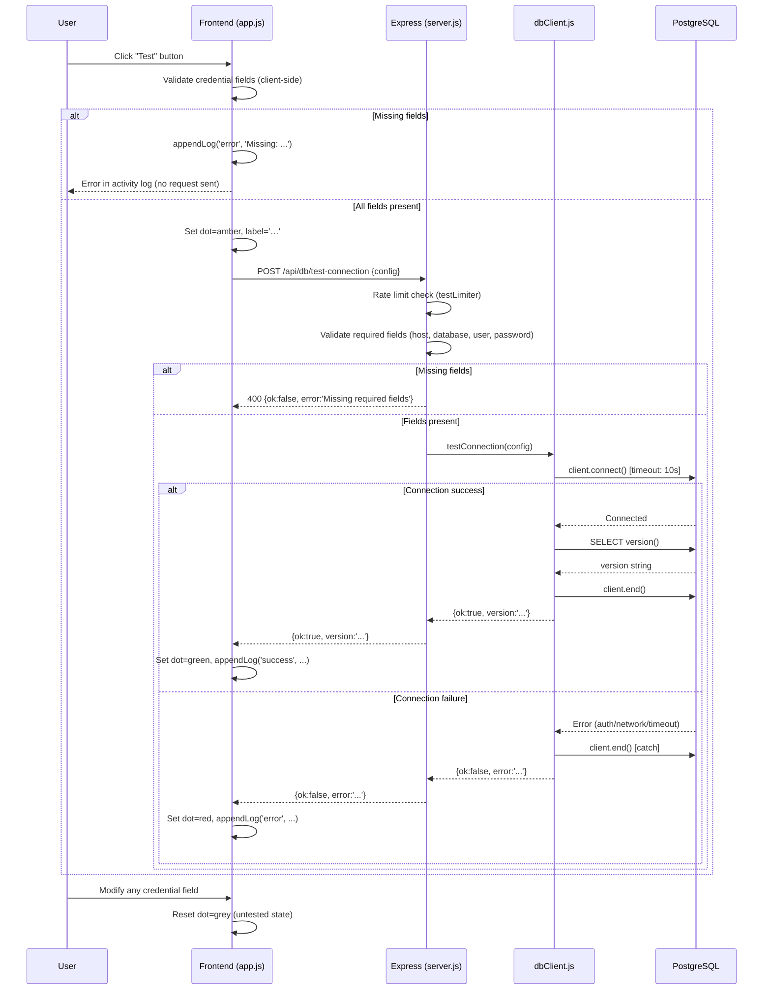

# Design Document: Database Connection Test

## Overview

This feature adds database connection testing to the existing database sync workflow in S3 Backup Studio. Users can click a "Test" button next to each database configuration panel (Source and Target) to verify their PostgreSQL credentials before starting a sync job.

The feature mirrors the existing S3 connection-test UX pattern already present in the application: a colored status dot next to each panel header reflects the last known connection state, and the activity log receives a success or error entry after each test.

The implementation touches three layers:
1. **Frontend** (`public/app.js`) — the `testDbConn(side)` function and its event wiring already exist in the codebase. The feature requires adding client-side validation before the fetch call and resetting the status dot on credential field changes.
2. **Backend** (`server.js`) — the `POST /api/db/test-connection` route already exists and is protected by the shared `testLimiter` (20 req/60 s). No new routes are needed.
3. **DB Client** (`src/dbClient.js`) — the `testConnection(config)` function already exists and correctly opens a connection, runs `SELECT version()`, and closes the connection in both success and failure paths.

The primary implementation work is adding the missing client-side validation (Requirement 4) and the status-dot reset on field change (Requirement 1.6 / 2.6), plus wiring up the existing `testDbConn` function to the "Test" buttons in the HTML.

---

## Architecture



---

## Components and Interfaces

### Frontend: `testDbConn(side)` (public/app.js)

The existing function handles the fetch and UI update. It needs to be extended with:

1. **Client-side validation** — before calling `fetch`, check that `host`, `database`, `user`, and `password` are non-empty. If any are missing, call `appendLog('error', ...)` and return early without making the request.
2. **Status dot reset on input** — attach `input` event listeners to the credential fields (`db-src-host`, `db-src-port`, `db-src-database`, `db-src-user`, `db-src-password` and their `db-dst-*` counterparts). On any change, reset the corresponding status dot to grey (`#334155`).

```javascript
// Extended testDbConn with validation
async function testDbConn(side) {
  const cfg = side === 'source' ? getDbConfig().source : getDbConfig().dest;
  const pfx = side === 'source' ? 'db-src' : 'db-dst';

  // Client-side validation
  const missing = [];
  if (!cfg.host)     missing.push('host');
  if (!cfg.database) missing.push('database');
  if (!cfg.user)     missing.push('username');
  if (!cfg.password) missing.push('password');
  if (missing.length > 0) {
    appendLog('error', `${side} DB test: missing required fields — ${missing.join(', ')}`);
    return;
  }

  const lbl = $(`${pfx}-test-label`);
  const dot = $(`${pfx}-status-dot`);
  lbl.textContent = '…';
  dot.style.background = '#fbbf24';

  const res = await fetch('/api/db/test-connection', {
    method: 'POST',
    headers: { 'Content-Type': 'application/json' },
    body: JSON.stringify({ config: cfg }),
  }).then(r => r.json()).catch(err => ({ ok: false, error: err.message }));

  lbl.textContent = 'Test';
  if (res.ok) {
    dot.style.background = '#34d399';
    dot.title = 'Connected';
    appendLog('success', `${side} DB connected — ${cfg.host}/${cfg.database}`);
  } else {
    dot.style.background = '#f87171';
    dot.title = res.error || 'Failed';
    appendLog('error', `${side} DB failed — ${res.error || 'Unknown error'}`);
  }
}
```

### Backend: `POST /api/db/test-connection` (server.js)

Already implemented. The route:
- Is protected by `testLimiter` (20 req / 60 s per IP, returns HTTP 429 on excess)
- Validates that `host`, `database`, `user`, and `password` are present (returns HTTP 400 if not)
- Delegates to `testConnection(config)` from `src/dbClient.js`
- Returns the result directly to the client

No changes required to `server.js`.

### DB Client: `testConnection(config)` (src/dbClient.js)

Already implemented. The function:
- Creates a `pg.Client` with `connectionTimeoutMillis: 10000`
- Calls `client.connect()`
- On success: runs `SELECT version()`, calls `client.end()`, returns `{ ok: true, version }`
- On failure: calls `client.end()` in a catch block, returns `{ ok: false, error: err.message }`

No changes required to `src/dbClient.js`.

### HTML: Status Dots and Test Buttons (public/index.html)

The HTML already contains the required elements:
- `#db-src-status-dot` and `#db-dst-status-dot` — colored status indicators
- `#btn-db-src-test` / `#btn-db-dst-test` — test buttons with `#db-src-test-label` / `#db-dst-test-label` spans
- Credential input fields: `db-src-host`, `db-src-port`, `db-src-database`, `db-src-user`, `db-src-password` (and `db-dst-*` equivalents)

No changes required to `index.html`.

---

## Data Models

### Connection Config (sent to backend)

```typescript
interface DbConnectionConfig {
  host: string;       // required
  port: number;       // defaults to 5432
  database: string;   // required
  user: string;       // required
  password: string;   // required
}
```

### Test Result (returned from backend)

```typescript
// Success
interface DbTestSuccess {
  ok: true;
  version: string;  // e.g. "PostgreSQL 15.3 on x86_64-pc-linux-gnu..."
}

// Failure
interface DbTestFailure {
  ok: false;
  error: string;    // descriptive error message from pg driver
}

type DbTestResult = DbTestSuccess | DbTestFailure;
```

### Status Dot States

| State     | Color     | Hex       | Meaning                        |
|-----------|-----------|-----------|--------------------------------|
| Untested  | Grey      | `#334155` | No test run yet, or reset      |
| In-flight | Amber     | `#fbbf24` | Test request in progress       |
| Success   | Green     | `#34d399` | Last test succeeded            |
| Failure   | Red       | `#f87171` | Last test failed               |

---

## Correctness Properties

*A property is a characteristic or behavior that should hold true across all valid executions of a system — essentially, a formal statement about what the system should do. Properties serve as the bridge between human-readable specifications and machine-verifiable correctness guarantees.*

### Property 1: Error message propagation

*For any* database side (source or destination) and *for any* error message string returned by the DB_Test_API, the activity log entry appended by the Connection_Tester SHALL contain that exact error message string.

**Validates: Requirements 1.5, 2.5**

---

### Property 2: Status dot reset on credential field change

*For any* database side (source or destination) and *for any* credential field belonging to that side (host, port, database, username, password), after the status dot has been set to a non-grey state, triggering an `input` event on that field SHALL reset the status dot to the untested grey color (`#334155`).

**Validates: Requirements 1.6, 2.6**

---

### Property 3: Test response shape correctness

*For any* connection outcome — whether the pg driver returns a version string (success) or throws an error (failure) — the `testConnection` function SHALL return an object whose `ok` field correctly reflects the outcome, and whose `version` (on success) or `error` (on failure) field contains the value produced by the driver.

**Validates: Requirements 3.2, 3.3**

---

### Property 4: Connection cleanup invariant

*For any* connection attempt — regardless of whether it succeeds or fails — the `testConnection` function SHALL call `client.end()` before returning, ensuring no connections are left open.

**Validates: Requirement 3.5**

---

### Property 5: Missing field validation prevents request

*For any* combination of credential fields where at least one required field (host, database, username, or password) is empty, the Connection_Tester SHALL NOT call `fetch` and SHALL append an error entry to the activity log.

**Validates: Requirements 4.1, 4.2**

---

### Property 6: Backend missing field validation

*For any* subset of required fields (host, database, user, password) that is absent from the request body, the DB_Test_API SHALL return HTTP 400 with `{ ok: false, error: "Missing required fields" }`.

**Validates: Requirement 3.4**

---

## Error Handling

| Scenario | Layer | Behavior |
|---|---|---|
| Missing credential fields (client) | Frontend | Log error, do not send request |
| Missing credential fields (server) | Backend | Return HTTP 400 `{ok:false, error:'Missing required fields'}` |
| Network error / fetch throws | Frontend | Catch error, set dot red, log error message |
| PostgreSQL auth failure | DB Client | Return `{ok:false, error:err.message}` |
| PostgreSQL connection timeout (10 s) | DB Client | pg driver throws timeout error; returned as `{ok:false, error:...}` |
| Rate limit exceeded | Backend | Return HTTP 429 `{ok:false, error:'Too many test-connection requests.'}` |
| `client.end()` throws on cleanup | DB Client | Swallowed with `.catch(()=>{})` to avoid masking the original error |

---

## Testing Strategy

### Unit Tests

Focus on specific examples and edge cases:

- `testDbConn('source')` with all fields populated sends a POST to `/api/db/test-connection`
- `testDbConn('source')` with a missing field does NOT call fetch and logs an error
- `testDbConn` with `{ok:true}` response sets dot to green
- `testDbConn` with `{ok:false}` response sets dot to red
- `testConnection` with a mocked pg.Client that connects successfully returns `{ok:true, version}`
- `testConnection` with a mocked pg.Client that throws returns `{ok:false, error}`
- `buildDbClient` creates a client with `connectionTimeoutMillis: 10000` (smoke check for Requirement 3.6)

### Property-Based Tests

Using [fast-check](https://github.com/dubzzz/fast-check) (already compatible with the Vitest setup in this project).

Each property test runs a minimum of 100 iterations.

**Property 1 — Error message propagation**
- Tag: `Feature: db-connection-test, Property 1: error message propagation`
- Generator: arbitrary non-empty string as error message
- Mock fetch to return `{ok:false, error: <generated>}`
- Assert: the log entry appended contains the generated error string

**Property 2 — Status dot reset on credential field change**
- Tag: `Feature: db-connection-test, Property 2: status dot reset on credential field change`
- Generator: arbitrary choice from the set of credential field IDs for each side
- Set dot to a non-grey color, dispatch `input` event on the chosen field
- Assert: dot background is `#334155`

**Property 3 — Test response shape correctness**
- Tag: `Feature: db-connection-test, Property 3: test response shape correctness`
- Generator: arbitrary version string (success path) or arbitrary error message (failure path)
- Mock pg.Client accordingly
- Assert: `testConnection` returns `{ok:true, version}` or `{ok:false, error}` matching the generated value

**Property 4 — Connection cleanup invariant**
- Tag: `Feature: db-connection-test, Property 4: connection cleanup invariant`
- Generator: arbitrary connection outcome (success or failure)
- Mock pg.Client
- Assert: `client.end()` is called exactly once in both paths

**Property 5 — Missing field validation prevents request**
- Tag: `Feature: db-connection-test, Property 5: missing field validation prevents request`
- Generator: arbitrary subset of {host, database, user, password} with at least one element removed
- Mock fetch
- Assert: fetch is NOT called; an error log entry is appended

**Property 6 — Backend missing field validation**
- Tag: `Feature: db-connection-test, Property 6: backend missing field validation`
- Generator: arbitrary subset of required fields omitted from the request body
- Assert: response status is 400 and body matches `{ok:false, error:'Missing required fields'}`

### Integration Tests

- Send 21 requests to `/api/db/test-connection` in sequence and verify the 21st returns HTTP 429 (Requirement 5.2)
- End-to-end: with a real PostgreSQL instance, verify `testConnection` returns `{ok:true, version}` containing "PostgreSQL"
